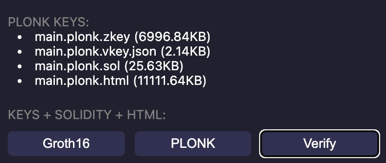

# Questions Sheet

1. Answer your questions in **answer sheet** markdown file.
2. If you're curious of more zk background knowledge, refer to https://zk-learning.org/
3. Watch Level 1 in this video: https://www.youtube.com/watch?v=fOGdb1CTu5c&pp=ygUcd2hhdCBpcyB6ZXJvIGtub3dsZWdlIHByb29mIA%3D%3D
4. 最下面的註解是會被讀取的，格式要照那個格式
5. 有同學反應第二題會遇到 Fetch error 這個問題我沒有遇過，也是第一次聽到，或許跟本地瀏覽器環境有關，有遇到的可以換個瀏覽器試試看

## question 1: 
Refer to https://docs.circom.io/circom-language/constraint-generation/. For circom code below, use your own words to explain what is `<==`

```
pragma circom 2.1.6;

include "circomlib/poseidon.circom";
// include "https://github.com/0xPARC/circom-secp256k1/blob/master/circuits/bigint.circom";

template Example () {
    signal input a;
    signal input b;
    signal output c;
    
    var unused = 4;
    c <== a * b;
    assert(a > 2);
    
    component hash = Poseidon(2);
    hash.inputs[0] <== a;
    hash.inputs[1] <== b;

    log("hash", hash.out);
}

component main { public [ a ] } = Example();

/* INPUT = {
    "a": "5",
    "b": "77"
} */
```

## question 2
1. refer to https://zkrepl.dev/ 
2. You don't need to modify anything, just click the PLONK button to the right bottom and see what happens.
3. What does main.plonk.sol do? What's its purpose? Explain in your own words.


## question 3
1. refer to https://zkrepl.dev/ 
2. You don't need to modify anything, just click the Groth16 button to the right bottom and see what happens.
3. Click Groth16 button and click `main.Groth16.zkey` and download zkey file.
4. Click `Verify` and upload the zkey file you just downloaded.
5. Explain below in your own words. What's `zkey` and `circuit`
```
VERIFIED: 
    ✅ Successfully verified zkey matches circuit
```

## question 4
1. Watch [What is Merkle Tree](https://www.youtube.com/watch?v=3AcQyTs_Es4&t=162s&ab_channel=KeralaBlockchainAcademy)
2. Watch [How to Verify Merkle Roots](https://www.youtube.com/watch?v=2kPFSoknlUU&t=191s&ab_channel=EddMann)
3. Fill in your answer for input `f`, input section is down below, you only need to edit "FILL YOUR ANSWER HERE" No need to edit anything else.
4. refer to and paste below code to editor. You may use `SHIFT + ENTER` to run the code

```
pragma circom 2.1.6;

include "circomlib/poseidon.circom";
// include "https://github.com/0xPARC/circom-secp256k1/blob/master/circuits/bigint.circom";

template MerkleTree () {
    signal input a, b, c, d;
    signal output e;
    signal input f;

    component hash = Poseidon(2);
    component hash2 = Poseidon(2);
    component hash3 = Poseidon(2);
    hash.inputs[0] <== a;
    hash.inputs[1] <== b;
    hash2.inputs[0] <== c;
    hash2.inputs[1] <== d;
    hash3.inputs[0] <== hash.out;
    hash3.inputs[1] <== hash2.out;
    e <== hash3.out;
    e === f;

    log(e);
}

component main = MerkleTree();

/* INPUT = {
    "a": "5",
    "b": "77",
    "c": "35",
    "d": "24",
    "f": "FILL YOUR ANSWER HERE IT'S A BIG INT"
} */
```

## question 5
Following the previous question
What's the merkle proof path for `a`? Answer in following format. No need to include root hash.
```
// 2 items in the path for example.
[1, 1];
```
